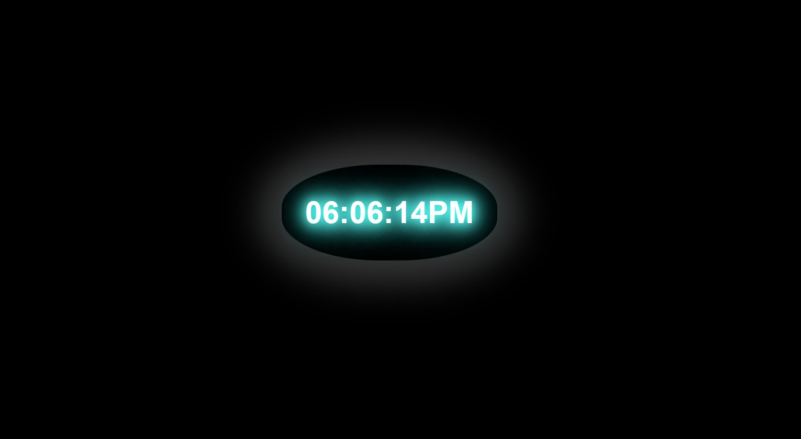

# Digital-clock-demo

Thanks for checking out this coding challenge.

This was a primary challenge to design a digital clock.

This is very basic code. A html document and mainly based on javascript.

It was made using Js looping method. 

Why not try if you are a kind of begainer! 

It could be a good practice to have the smell of Js.

# Have fun building a project !